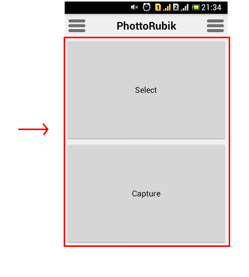
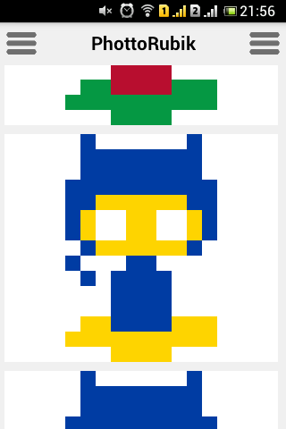
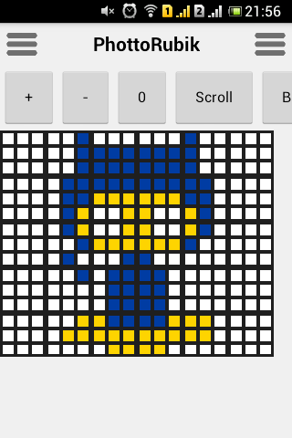

# PhotoRubik

A CodenameOne mobile application that turns an image into a Rubik's Cube mosaic.

## Note

Looks like the upgrade broke the theme, but the functinality is mostly the same.

## Some screens from the past

1. Main screen, you can select a photo or take a new one.

    

2. The selected image is transformed into a series depicting different stages
of the transformation and all combinations of results.

    

3. Tap on one of them and it gets sent to the editor.

    

4. After you finish editing you can select `Stats`

    [Stats button](images/4.png)

5. You get the stats about that cube faces you need to build the mosaic irl.

    [Stats](images/5.png)

6. You can repeat the process from the left hamburger menu.

    [Left hamburger](images/6.png)

7. You can set the maximum number of cubes available from the right hamburger
menu.

    [Right hamburger](images/7.png)

## LICENSE

This plugin is covered by the BSD license, see [LICENSE](LICENSE) for details.
